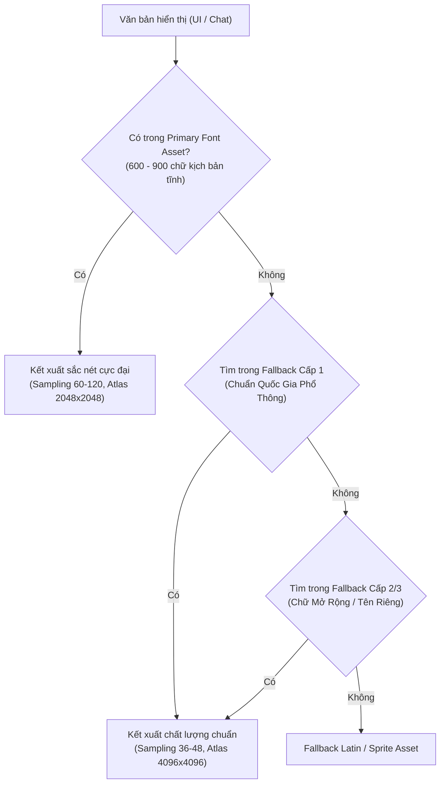

## **1. Tổng Quan Dự Án Và Thách Thức Nội Địa Hóa Thời Gian Thực**

Dự án **GilongWorld** đặt ra một yêu cầu kỹ thuật vô cùng phức tạp và mang tính quy mô toàn cầu: hỗ trợ nội địa hóa (*localization*) toàn diện cho 15 ngôn ngữ mục tiêu. Danh sách này bao gồm English, Vietnamese, French, Italian, German, Spanish (Spain), Polish, Portuguese (Brazil), Portuguese (Portugal), Korean, Russian, Japanese, Turkish, Simplified Chinese và Traditional Chinese. Trong bối cảnh phát triển trò chơi hiện đại sử dụng engine Unity, việc quản lý và hiển thị văn bản trong không gian đồ họa thời gian thực không đơn thuần là quá trình thay thế các chuỗi ký tự văn bản. Nó đòi hỏi một kiến trúc phông chữ tối ưu toàn diện nhằm đảm bảo tính thẩm mỹ, độ sắc nét của hình ảnh ở mọi khoảng cách camera, và quan trọng nhất là tính hiệu quả trong việc sử dụng bộ nhớ hệ thống.

Công cụ tiêu chuẩn và mạnh mẽ nhất hiện nay trong hệ sinh thái Unity để hiển thị văn bản là **TextMeshPro (TMP)**. Khác biệt hoàn toàn với các hệ thống văn bản giao diện người dùng (UI Text) truyền thống vốn kết xuất từng ký tự dưới dạng ảnh bitmap mờ nhạt khi phóng to, TextMeshPro yêu cầu chuyển đổi các tệp phông chữ tiêu chuẩn thành các tài nguyên chuyên biệt gọi là **Font Asset**[^1]. Các Font Asset này chứa một hoặc nhiều kết cấu ảnh (*Atlas Texture*) áp dụng công nghệ **Signed Distance Field (SDF)**. Công nghệ SDF cho phép văn bản được phóng to vô hạn mà không bị vỡ hạt (*pixelation*), đồng thời cung cấp nền tảng toán học để shader của bộ thu phóng tạo ra các hiệu ứng đồ họa phức tạp như đổ bóng, đường viền, độ dày mỏng và hiệu ứng phát sáng trực tiếp trên GPU[^1].

Tuy nhiên, sức mạnh của SDF đi kèm với một thách thức vật lý không thể tránh khỏi: **giới hạn bộ nhớ**. Việc chứa toàn bộ ký tự của 15 ngôn ngữ mục tiêu vào một kết cấu ảnh duy nhất là điều bất khả thi[^1]. Đặc biệt, các ngôn ngữ thuộc nhóm CJK (*Chinese, Japanese, Korean*) sở hữu hệ thống văn tự tượng hình đồ sộ với hàng chục nghìn ký tự. Nếu cố gắng ép buộc toàn bộ hệ thống này vào một Atlas Texture, kích thước của kết cấu sẽ vượt quá giới hạn tối đa mà các thiết bị phần cứng, đặc biệt là phần cứng di động, có thể xử lý (thường là $4096 \times 4096$ hoặc $8192 \times 8192$ pixel), dẫn đến hiện tượng tràn bộ nhớ VRAM hoặc sập ứng dụng (*crash*)[^5]. Báo cáo này sẽ trình bày một cách cặn kẽ và chi tiết quy trình từ việc lựa chọn, tải xuống phông chữ nguồn, phân tích đặc tính ngữ hệ, đến việc cấu hình các thông số nội bộ của TextMeshPro, quản lý chuỗi dự phòng (*Fallback Chain*) và xử lý triệt để bài toán đồng nhất Hán tự (*Han Unification*) thông qua gói Unity Localization.

---

## **2. Nền Tảng Ký Tự Học Và Chiến Lược Tải Phông Chữ Nguồn**

Bước đầu tiên và quan trọng nhất trong việc thiết lập một hệ thống văn bản đa ngôn ngữ là lựa chọn tệp phông chữ nguồn (*Source Font File*) chuẩn xác. Tính nhất quán về mặt thị giác trên 15 ngôn ngữ yêu cầu một bộ phông chữ mã nguồn mở, hỗ trợ toàn diện các dải mã Unicode từ cơ bản đến mở rộng, và có thiết kế đồng nhất về độ cao cơ sở (*baseline*) cũng như độ dày của nét chữ (*weight*).

Trong ngành công nghiệp phần mềm, gia đình phông chữ **Google Noto** (viết tắt của cụm từ *"No Tofu"* - một sứ mệnh nhằm loại bỏ các ô vuông hiển thị khi thiết bị thiếu ký tự hiển thị, thường được gọi lóng là "đậu phụ") được công nhận là giải pháp tiêu chuẩn vàng[^7]. Hệ thống Noto được thiết kế bởi Google hợp tác cùng các đối tác công nghệ hàng đầu, đảm bảo rằng các ký tự thuộc bảng chữ cái Latin, Cyrillic, và các hệ thống chữ viết CJK có thể hiển thị song song trên cùng một dòng văn bản mà không tạo ra sự chênh lệch về tỷ lệ hay phong cách nghệ thuật[^8]. Sự mượt mà khi văn bản chứa nhiều ngôn ngữ đan xen là yếu tố sống còn đối với trải nghiệm người dùng trong GilongWorld.

### **Hướng Dẫn Trích Xuất Và Nhập Dữ Liệu Phông Chữ Vào Unity**

Để bắt đầu quá trình tích hợp, các tệp phông chữ gốc cần được tải xuống trực tiếp từ thư viện **Google Fonts**. Quá trình tải và nhập dữ liệu vào Unity cần tuân thủ một quy trình nghiêm ngặt nhằm tránh việc làm phình to dung lượng dự án một cách không cần thiết:

1. **Nhóm 11 ngôn ngữ sử dụng hệ chữ cái Latin và Cyrillic** (*English, Vietnamese, French, Italian, German, Spanish, Polish, Portuguese - Brazil, Portuguese - Portugal, Russian, Turkish*): Hệ thống chỉ yêu cầu bộ phông chữ cơ bản là **Noto Sans**[^8]. Bộ phông chữ này chứa đựng hơn 3.700 ký tự (*glyphs*) bao phủ các khối Unicode như Latin Extended, Cyrillic, và các dấu phụ kết hợp, hoàn toàn đáp ứng được nhu cầu của các ngôn ngữ kể trên[^8]. Tại trang chủ của Google Fonts, việc tải xuống sẽ cung cấp một tập tin nén chứa nhiều biến thể về độ dày (như *Thin, Regular, Medium, Bold, Black*) dưới định dạng tệp TrueType (`.ttf`).
2. **Nhóm 4 ngôn ngữ CJK**: Quy trình tải xuống trở nên phức tạp hơn. Các nhà phát triển cần truy cập vào các biến thể riêng biệt bao gồm **Noto Sans JP** (tiếng Nhật), **Noto Sans KR** (tiếng Hàn), **Noto Sans SC** (tiếng Trung Giản thể) và **Noto Sans TC** (tiếng Trung Phồn thể)[^7]. Các tệp CJK này thường có dung lượng rất lớn, dao động từ 15MB đến 20MB cho mỗi độ dày phông chữ do chứa lượng dữ liệu đồ họa khổng lồ. Định dạng thường thấy đối với nhóm này là OpenType (`.otf`), vốn hỗ trợ các cấu trúc bảng ký tự phức tạp hơn so với TrueType[^5].

Sau khi giải nén các tệp từ Google Fonts, bước tiếp theo là nhập (*import*) chúng vào môi trường dự án Unity. Một phương pháp thực hành tốt (*best practice*) trong quản lý tài nguyên là tạo một cấu trúc thư mục chuyên biệt, ví dụ `Assets/GilongWorld_Resources/Fonts/Source_Files/`. Các tệp `.ttf` và `.otf` (chỉ nên chọn một độ dày tiêu chuẩn như *Regular* hoặc *Medium* để tối ưu hóa bộ nhớ, trừ khi thiết kế UI yêu cầu cụ thể các biến thể in đậm) sẽ được kéo và thả trực tiếp từ hệ điều hành vào thư mục này thông qua cửa sổ Project của Unity Editor[^10]. 

> [!NOTE]
> TextMeshPro không trực tiếp sử dụng các tệp `.ttf` hay `.otf` này để kết xuất văn bản tại thời gian thực; chúng chỉ đóng vai trò là nguyên liệu thô để công cụ Font Asset Creator trích xuất dữ liệu mảng và biên dịch thành kết cấu SDF[^1]. Việc quản lý các tệp nguồn ở một thư mục riêng biệt giúp quá trình loại bỏ chúng khỏi các bản build cuối cùng (nếu không sử dụng tính năng Dynamic SDF) trở nên dễ dàng hơn, góp phần giảm dung lượng gói cài đặt của trò chơi.

---

## **3. Phân Tích Đặc Tính Ngữ Hệ Và Yêu Cầu Dải Mã Unicode**

Sự đa dạng của 15 ngôn ngữ trong dự án GilongWorld đòi hỏi một sự phân tích sâu sắc về cách thức các ký tự được mã hóa trong hệ thống tiêu chuẩn quốc tế Unicode. TextMeshPro sử dụng hệ thống Hexadecimal (hệ cơ số 16) để xác định các dải mã (*Unicode Ranges*) cần trích xuất từ tệp phông chữ nguồn[^13]. Việc khai báo chính xác các dải mã này không chỉ đảm bảo độ bao phủ ngôn ngữ tuyệt đối mà còn ngăn chặn việc nạp các ký tự vô ích làm phình to kích thước kết cấu Atlas.

Dựa trên cấu trúc hình thái học, 15 ngôn ngữ được chia thành ba nhóm chiến lược chính để quản lý tài nguyên.

### **Phân Nhóm 1: Hệ Latin Mở Rộng Và Diacritics (Dấu Phụ)**

Nhóm này bao gồm English, French, Italian, German, Spanish, Polish, Portuguese (Brazil), Portuguese (Portugal), Turkish và Vietnamese. Mặc dù cùng chia sẻ nền tảng bảng chữ cái Latin cơ bản (`U+0020` đến `U+007E`), sự phân hóa diễn ra mạnh mẽ ở các khối mã mở rộng[^1].

- **Tây Âu và Nam Âu** (*French, Spanish, Italian, Portuguese, German*): Chủ yếu sử dụng khối *Latin-1 Supplement* (`U+00A0` đến `U+00FF`), nơi chứa các nguyên âm mang dấu cơ bản như `á`, `é`, `í`, `ó`, `ú`, `ñ`, `ü`, và `ç`.
- **Trung Âu và Thổ Nhĩ Kỳ** (*Polish, Turkish*): Phụ thuộc vào khối *Latin Extended-A* (`U+0100` đến `U+017F`) để hiển thị các ký tự đặc thù như `ą`, `ł`, `ş`, và `ğ`[^10].
- **Tiếng Việt**: Đáng chú ý nhất trong nhóm này. Với hệ thống thanh điệu phức tạp kết hợp với các nguyên âm đội mũ (`â`, `ê`, `ô`) hoặc mang râu (`ơ`, `ư`), tiếng Việt đòi hỏi khối mã *Latin Extended Additional* (`U+1E00` đến `U+1E9F`)[^14]. Hệ thống dấu phụ của tiếng Việt tạo ra các cấu trúc ký tự có độ cao rất lớn (ví dụ: chữ `Ể` có thể vượt quá giới hạn chiều cao thông thường của bảng chữ cái Latin), đòi hỏi khoảng cách dòng (*line height*) và khoảng đệm (*padding*) trong TextMeshPro phải được tinh chỉnh cẩn thận để tránh hiện tượng cắt xén (*clipping*) đỉnh của ký tự.

### **Phân Nhóm 2: Hệ Cyrillic**

Ngôn ngữ duy nhất trong dự án thuộc hệ này là **Russian (tiếng Nga)**. Bảng chữ cái Cyrillic hoàn toàn độc lập với hệ Latin về mặt mã hóa, nằm gọn trong khối mã `U+0400` đến `U+04FF`[^10]. Mặc dù độc lập về mặt mã hóa, ngôn ngữ Cyrillic chia sẻ nhiều đặc điểm hình thái học với hệ Latin về độ rộng ký tự và độ cao cơ sở, cho phép nó được gộp chung một cách hoàn hảo vào cùng một Font Asset với nhóm Latin mà không gây ra sự mất cân đối về mặt thị giác.

### **Phân Nhóm 3: Hệ CJK Và Biến Cố Lịch Sử Han Unification**

Nhóm thứ ba bao gồm **Korean, Japanese, Simplified Chinese và Traditional Chinese**. Đây là khu vực phức tạp nhất, nơi giới hạn công nghệ của TextMeshPro thường xuyên bị thử thách. Nguyên nhân gốc rễ không chỉ nằm ở số lượng ký tự khổng lồ mà còn liên quan đến một quy ước kỹ thuật gây tranh cãi của Hiệp hội Unicode được gọi là **Han Unification** (*Sự thống nhất Hán tự*)[^7].

Trong những năm đầu phát triển chuẩn Unicode, để giới hạn không gian mã hóa trong phạm vi 16-bit, các kỹ sư phần mềm đã quyết định gộp chung các ký tự tượng hình có cùng nguồn gốc lịch sử từ Trung Quốc, Nhật Bản và Hàn Quốc vào cùng một điểm mã (*code point*) duy nhất[^7]. Khối mã này được gọi là *CJK Unified Ideographs*, trải dài từ `U+4E00` đến `U+9FA5`[^12].

Quyết định này mang lại một hệ lụy nghiêm trọng trong kỹ thuật hiển thị: **mặc dù chia sẻ chung một mã Unicode, hình dáng thực tế của cùng một ký tự (glyph) lại được vẽ khác nhau ở các quốc gia** do sự phát triển văn hóa, nghệ thuật thư pháp và tiêu chuẩn giáo dục phân kỳ:

- Điển hình là ký tự "Cốt" (Xương), mang mã Unicode `U+9AA8` (骨). Cấu trúc nét vẽ bên trong hình chữ nhật phía trên của ký tự này ở phông chữ Simplified Chinese (SC) được bố trí theo chiều ngang trái-phải, trong khi ở Traditional Chinese (TC) và Japanese (JP), nó lại được cấu trúc theo một dạng nét hoàn toàn khác biệt[^7].
- Tương tự, ký tự "Tuyết" (雪) hay "Trực" (直) cũng mang những khác biệt vi tế nhưng cực kỳ dễ nhận biết đối với người bản xứ.

Hệ thống kết xuất văn bản không thể tự phán đoán hình thái học; nó chỉ nhận một mã Unicode và lấy hình ảnh tương ứng từ bộ phông chữ hiện hành. Do đó, việc sử dụng chung một phông chữ CJK cho mọi ngôn ngữ Đông Á sẽ dẫn đến hiện tượng người Nhật Bản phải đọc văn bản tiếng Nhật được vẽ theo phong cách Trung Quốc, hoặc ngược lại[^7]. Đối với người bản xứ, điều này tạo ra cảm giác văn bản bị lỗi font, thiếu chuyên nghiệp hoặc "lai tạp", phá vỡ hoàn toàn sự nhập tâm vào thế giới của trò chơi[^7]. Giải pháp duy nhất để khắc phục giới hạn này là tách biệt hoàn toàn các Font Asset cho từng ngôn ngữ CJK và thao tác quản lý chuỗi dự phòng một cách linh hoạt.

---

## **4. Cơ Chế Kỹ Thuật Của TextMeshPro Và Signed Distance Field (SDF)**

Để thực thi quy trình thiết lập chuẩn xác, việc thấu hiểu cơ chế hoạt động của **Signed Distance Field (SDF)** trong TextMeshPro là bắt buộc. Khác với phông chữ Bitmap truyền thống lưu trữ màu sắc của các điểm ảnh, SDF lưu trữ khoảng cách toán học từ một điểm ảnh đến rìa (cạnh) gần nhất của ký tự[^1]:
- Nếu một điểm ảnh nằm **bên trong** ký tự, khoảng cách mang giá trị **dương**.
- Nếu nằm **bên ngoài**, nó mang giá trị **âm**.
- Nếu nằm **chính xác trên cạnh**, khoảng cách bằng **không** ($0$).

Dữ liệu khoảng cách này được mã hóa dưới dạng sắc độ xám (*grayscale*) lưu trữ trong một Atlas Texture. Tại thời gian thực, GPU shader của TextMeshPro sẽ nội suy song tuyến tính (*bilinear interpolation*) các giá trị khoảng cách này. Shader sẽ kiểm tra giá trị của từng mảnh (*fragment*) trên màn hình: nếu giá trị $> 0$, mảnh đó được vẽ màu; nếu $< 0$, nó bị làm trong suốt. Nhờ bản chất là một phép toán nội suy liên tục thay vì phụ thuộc vào các điểm ảnh rời rạc, văn bản SDF hiển thị các đường cong cực kỳ sắc nét ngay cả khi camera tiến sát vào đối tượng[^1].

Cơ chế này định hình hai thông số cốt lõi khi tạo Font Asset:
1. **Sampling Point Size:** Quyết định kích thước vật lý của ký tự khi nó được vẽ lên Atlas Texture. Kích thước càng lớn, độ chi tiết của dữ liệu khoảng cách càng cao.
2. **Padding (Khoảng đệm):** Chìa khóa sức mạnh của SDF. Không gian đệm xung quanh ký tự cho phép gradient khoảng cách giảm dần về các giá trị âm sâu hơn. Khoảng đệm càng rộng, thuật toán SDF càng có nhiều "không gian" để tạo ra các hiệu ứng đường viền (*outline*), bóng đổ (*shadow*), hoặc phát sáng (*glow*) với độ dày lớn mà không bị cắt cụt một cách đột ngột[^13].

---

## **5. Hướng Dẫn Thiết Lập Chi Tiết Qua Font Asset Creator**

Việc tạo các tệp kết cấu phông chữ được thực hiện thông qua công cụ nội bộ của Unity: **Font Asset Creator**, truy cập qua thanh trình đơn:
```text
Window > TextMeshPro > Font Asset Creator
```

Dựa trên phân tích ở Phần 3, cấu trúc tối ưu cho 15 ngôn ngữ trong dự án GilongWorld là một mô hình phân mảnh: **tạo một Font Asset chung cho 11 ngôn ngữ hệ Latin/Cyrillic, và 4 Font Asset riêng biệt cho từng ngôn ngữ CJK**.

### **5.1. Thiết Lập Cấu Trúc Tĩnh (Static) Cho Hệ Latin, Cyrillic Và Vietnamese**

Việc gộp 11 ngôn ngữ (*English, French, Italian, German, Spanish, Polish, Portuguese BR, Portuguese PT, Turkish, Russian, Vietnamese*) vào một **Primary Static Font Asset** duy nhất là phương pháp hiệu quả nhất để giảm thiểu số lượng lệnh vẽ (*draw call*) trên GPU, vốn đóng vai trò then chốt trong việc duy trì tốc độ khung hình (*frame rate*) ổn định[^14].

Quá trình cấu hình trong Font Asset Creator được thực hiện với các thông số nghiêm ngặt sau[^12]:

| Thuộc tính Cấu hình | Khuyến nghị Kỹ thuật | Lý luận Phân tích |
| :--- | :--- | :--- |
| **Source Font File** | `NotoSans-Regular.ttf` | Kéo và thả tệp gốc từ thư mục `Assets` vào trường này. Đây là nguồn dữ liệu hình học[^1]. |
| **Sampling Point Size** | `Custom Size: 60 - 90` | Chế độ Auto Sizing chỉ cố gắng nhét các ký tự vào không gian khả dụng. Bằng cách thiết lập cứng Custom Size ở mức 60 đến 90, chất lượng của dữ liệu SDF được đảm bảo nhất quán trên toàn bộ bề mặt kết cấu[^1]. |
| **Padding** | `6 - 9` (Tỷ lệ ~10%) | Quy tắc chuẩn trong TextMeshPro là Padding nên chiếm khoảng 10% của Sampling Point Size[^4]. Với Sampling 60, Padding 6 là lý tưởng. Nếu dự án có các phong cách UI yêu cầu viền bao quanh chữ rất dày, con số này có thể đẩy lên 10. |
| **Packing Method** | `Optimum` | Thuật toán Optimum tốn nhiều thời gian xử lý hơn đáng kể so với Fast, nhưng nó thực hiện các phép lặp để nhồi nhét chặt chẽ nhất các glyph vào không gian, giảm thiểu lãng phí điểm ảnh[^12]. |
| **Atlas Resolution** | `2048 x 2048` | Số lượng ký tự của 11 ngôn ngữ này rơi vào khoảng 1.500 đến 2.000 glyph. Kích thước $2048 \times 2048$ đủ không gian để duy trì Sampling Point Size 60 mà không bị cắt bỏ bất kỳ ký tự nào[^7]. |
| **Character Set** | `Unicode Range (Hex)` | Thay vì chọn các tập hợp định sẵn, chế độ này cung cấp sự kiểm soát tuyệt đối về các ký tự được nạp vào[^2]. |

Trường **Custom Character List** sẽ được điền chuỗi dải mã Hex bao phủ hoàn toàn nhu cầu của 11 ngôn ngữ:

```text
0020-007E, 00A0-00FF, 0100-017F, 0180-024F, 1E00-1E9F, 0300-036F, 0400-04FF, 0500-052F, 2000-206F
```

Sau khi các thông số được điền hoàn tất:
1. Nhấn nút **Generate Font Atlas**. Công cụ sẽ tiến hành tính toán khoảng cách và kết xuất ảnh (có thể mất vài phút tùy CPU).
2. Khi hoàn tất và bản xem trước kết cấu hiển thị, nhấn **Save**.
3. Lưu tệp với tên `Global_Latin_Cyrillic_SDF.asset` vào thư mục dự án[^1].

### **5.2. Thiết Lập Cấu Trúc Tĩnh (Static) Cho Hệ CJK Và Kiến Trúc Phân Tầng Fallback**

Xử lý 4 ngôn ngữ CJK yêu cầu một tiếp cận hoàn toàn khác biệt do khối lượng dữ liệu khổng lồ. Việc lặp lại quy trình trên bốn lần cho `NotoSansCJKjp`, `NotoSansCJKkr`, `NotoSansCJKsc`, và `NotoSansCJKtc` là bắt buộc. Tuy nhiên, nếu cố gắng đưa toàn bộ bảng CJK vào một Atlas tĩnh duy nhất thông qua dải mã Unicode, hệ thống sẽ thất bại do vượt quá kích thước vật lý của kết cấu[^5].

Giải pháp kỹ thuật chuẩn mực là áp dụng **Mô hình Phân Tầng Ký Tự (Hierarchical Character Mapping)** kết hợp tùy chọn **Characters from File**[^7]:

#### **1. Tạo Primary SDF Font Asset Cho Ký Tự Đã Biết (Known Characters)**
- Trích xuất toàn bộ chuỗi văn bản tĩnh từ các bảng chuỗi (*String Tables*) của dự án (Menu, Quest, Item, Dialogues, Skills).
- Tập hợp ký tự độc nhất (*unique characters*) này trong thực tế thường **dưới 1.000 ký tự** (điển hình như trong dự án GilongWorld chỉ chiếm **855 ký tự** cho tiếng Trung Giản thể, **870 ký tự** cho Phồn thể, **694 ký tự** cho tiếng Nhật, và **588 ký tự** cho tiếng Hàn).
- **Tối đa hóa chất lượng (Maximize Sampling Size):** Do số lượng ký tự chỉ < 1.000, ta có thể đặt **Sampling Point Size cao** (từ `60` đến `90` hoặc `120`) với Atlas Resolution `2048 x 2048`. Điều này đảm bảo toàn bộ văn bản UI chính thức luôn đạt độ sắc nét tuyệt hảo ở mọi cự ly camera.

#### **2. Xây Dựng Các Tầng Fallback Kế Thừa Từ Bộ Ký Tự Chuẩn Quốc Gia (Standard Fallbacks for UGC/Chat)**
Để hỗ trợ toàn diện việc người chơi nhập liệu (đặt tên nhân vật, chat cộng đồng) mà không bao giờ gặp ô vuông Tofu, hệ thống bổ sung các Font Asset Fallback kế thừa từ **các bộ dữ liệu ký tự chuẩn quốc gia**:

| Ngôn Ngữ | Bộ Ký Tự Tiêu Chuẩn Quốc Gia | Số Lượng Ký Tự | Cơ Quan Ban Hành & Nguồn Tham Chiếu |
| :--- | :--- | :---: | :--- |
| **Simplified Chinese (zh-Hans)** | **TGSCC (通用规范汉字表)**<br/>- Cấp 1 (Phổ thông): 3.500 chữ<br/>- Cấp 2 (Mở rộng): 3.000 chữ<br/>- Cấp 3 (Tên riêng/Địa danh): 1.605 chữ | **8.105** | Bộ Giáo dục CHND Trung Hoa<br/>*Nguồn mở:* [GitHub chinese-character-table](https://github.com/maple-leaf/chinese-character-table) |
| **Traditional Chinese (zh-Hant)** | **Bảng chữ Hán thường dùng** (*常用國字標準字體表*) | **4.808** | Bộ Giáo dục Đài Loan (MOE Taiwan)<br/>*Nguồn mở:* [Cổng dữ liệu mở Đài Loan](https://data.gov.tw/dataset/5961) / [GitHub cjktables](https://github.com/ButTaiwan/cjktables) |
| **Japanese (ja)** | - **Jōyō Kanji** (常用漢字 - Thường dụng): 2.136 chữ<br/>- **Jinmeiyō Kanji** (人名用漢字 - Tên người): 863 chữ | **2.999** | Cục Văn hóa Nhật Bản (文化庁)<br/>*Nguồn mở:* [KanjiAPI](https://kanjiapi.dev/) / [GitHub kanji-data](https://github.com/davidluzgouveia/kanji-data) |
| **Korean (ko)** | **Bảng chuẩn KS X 1001** (2.350 âm tiết Hangul phổ thông nhất, bao phủ 99.9% giao tiếp) | **2.350** | Cơ quan Tiêu chuẩn Hàn Quốc (KATS)<br/>*Nguồn mở:* [GitHub ksx1001](https://github.com/korean-character-sets/ksx1001) / Trích xuất qua `euc-kr` |



#### **3. Quy Luật Bất Biến: Duy Trì Tỷ Lệ Sampling Point Size / Padding (Ratio Consistency)**

Một nguyên lý đồ họa cốt lõi trong TextMeshPro Shader: **Độ dày của các hiệu ứng Outline (Viền chữ), Underlay / Shadow (Bóng đổ), và Glow (Phát sáng) được tính toán dựa trên tỷ lệ giữa Sampling Point Size và Padding**[^13].

##### **Tại sao Fallback không cần cùng Point Size với Primary?**
- **Primary Font (~855 chữ kịch bản UI):** Xuất hiện 100% thời gian chơi $\rightarrow$ Cần **tối đa hóa chất lượng** (`Sampling Size = 120`, `Padding = 10`, Atlas $2048 \times 2048$).
- **Fallback Fonts (2.700 – 8.000 chữ hiếm cho Chat/Tên):** Rất ít xuất hiện $\rightarrow$ **Hạ chất lượng lấy mẫu** (`Sampling Size = 60` hoặc `48`) để nén hàng nghìn chữ vào cùng kích thước Atlas mà không làm phình to VRAM.

##### **Tại sao bắt buộc phải giữ cùng Tỷ Lệ ($\text{Ratio} = \frac{\text{Sampling}}{\text{Padding}}$)?**
Nếu trong một câu văn có chữ thuộc Primary đi liền với chữ thuộc Fallback:
- **Nếu lệch tỷ lệ:** Chữ Primary (Size 120, Pad 10 $\rightarrow$ Ratio 12) có viền thanh mảnh đẹp mắt, nhưng chữ Fallback (Size 60, nhưng lỡ để Pad 10 $\rightarrow$ Ratio 6) sẽ có **viền bị dày cộm gấp đôi, biến dạng và nuốt chửng nét chữ**.
- **Nếu giữ cùng tỷ lệ ($\text{Ratio} = 12$):** Dù chữ lấy từ Primary hay rớt xuống Fallback, **độ dày viền và bóng đổ luôn đồng nhất 100%**.

| Tầng Font Asset | Vai trò | Sampling Point Size *(Custom)* | Padding | Atlas Resolution | Tỷ lệ (Ratio) |
| :--- | :--- | :---: | :---: | :---: | :---: |
| **Primary Font** | Kịch bản UI chính | **120** *(hoặc 96)* | **10 px** *(hoặc 8 px)* | $2048 \times 2048$ | **12** *(Độ nét tối đa)* |
| **Fallback Cấp 1** | ~2.725 chữ thông dụng | **60** | **5 px** | $2048 \times 2048$ | **12** *(Tiết kiệm VRAM)* |
| **Fallback Cấp 2** | ~2.992 chữ mở rộng | **60** | **5 px** | $2048 \times 2048$ | **12** *(Tiết kiệm VRAM)* |
| **Fallback Cấp 3** | ~1.605 chữ hiếm/tên | **48** | **4 px** | $2048 \times 2048$ | **12** *(Tiết kiệm VRAM)* |

> [!TIP]
> **Thao tác thực tế:** Trong *Font Asset Creator*, chuyển `Sampling Point Size` từ *Auto Sizing* sang **Custom Size** để cố định kích thước lấy mẫu và Padding theo đúng tỷ lệ bảng trên.

---

### **5.3. Quy Trình Tổ Chức Thư Mục Và Tự Động Hóa Thực Tế Trong Unity**

Để dễ dàng mở rộng và bảo trì lâu dài, dự án GilongWorld thiết lập cấu trúc thư mục phân nhóm chuyên biệt cho toàn bộ dữ liệu ký tự nguồn:

```text
Assets/_GilongWorld/_Project/Art/Fonts/_chars/
├── 01_Latin_Cyrillic/        # [Primary Font chung] 11 ngôn ngữ Latin/Cyrillic
│   ├── vi_chars.txt          # Tiếng Việt
│   ├── en_chars.txt          # Tiếng Anh
│   ├── ru_chars.txt          # Tiếng Nga
│   └── ...                   # Pháp, Đức, Ý, TBN, Ba Lan, Bồ Đào Nha, Thổ Nhĩ Kỳ
│
├── 02_CJK/                   # [Primary Fonts CJK] Ký tự kịch bản tĩnh trong game
│   ├── ja_chars.txt          # Tiếng Nhật (694 ký tự thực tế)
│   ├── ko_chars.txt          # Tiếng Hàn (588 ký tự thực tế)
│   ├── zh_Hans_chars.txt     # Trung Giản thể (855 ký tự thực tế)
│   ├── zh_Hant_chars.txt     # Trung Phồn thể (870 ký tự thực tế)
│   │
│   ├── Standard_Fallbacks/   # [Tầng Nguồn Chuẩn] 7 bộ dữ liệu chuẩn quốc gia gốc
│   │   ├── zh_Hans_TGSCC_Level1_3500.txt
│   │   ├── zh_Hans_TGSCC_Level2_3000.txt
│   │   ├── zh_Hans_TGSCC_Level3_1605.txt
│   │   ├── zh_Hant_Common_4808.txt
│   │   ├── ja_Joyo_Kanji_2136.txt
│   │   ├── ja_Jinmeiyo_Kanji_863.txt
│   │   └── ko_KS_X_1001_2350.txt
│   │
│   └── Subtracted_Fallbacks/ # [Tầng Fallbacks Tối Ưu] Đã trừ sạch ký tự Primary
│       ├── zh_Hans_Fallback_Level1.txt    (TGSCC Cấp 1 trừ Primary)
│       ├── zh_Hans_Fallback_Level2.txt    (TGSCC Cấp 2 trừ Primary)
│       ├── zh_Hans_Fallback_Level3.txt    (TGSCC Cấp 3 trừ Primary)
│       ├── zh_Hant_Fallback_Common.txt    (Chuẩn ĐL 4808 trừ Primary)
│       ├── ja_Fallback_Joyo.txt           (Joyo Kanji trừ Primary)
│       ├── ja_Fallback_Jinmeiyo.txt       (Jinmeiyo Kanji trừ Primary)
│       └── ko_Fallback_KS_X_1001.txt      (KS X 1001 trừ Primary)
```

#### **Công Cụ Tự Động Trích Xuất & Phép Trừ Ký Tự Fallback (`GWCharacterExtractor.cs`)**
Nhằm giải phóng lập trình viên khỏi việc xuất CSV và lọc ký tự trùng lặp thủ công, công cụ Unity Editor chuyên biệt [`GWCharacterExtractor.cs`](file:///d:/Unity-Projects/GLW/Assets/_GilongWorld/_Project/Editor/Localization/GWCharacterExtractor.cs) được tích hợp quy trình 2 trong 1:
- **Menu truy cập:** `GilongWorld → Localization → Extract CJK Characters From String Tables`
- **Cơ chế 1 (Trích xuất Primary):** Quét toàn bộ `StringTableCollections` trong Unity Localization, gom toàn bộ chuỗi văn bản đang được sử dụng vào cấu trúc `HashSet<char>` (đảm bảo tính độc nhất 100%), sắp xếp theo mã Unicode tăng dần và ghi vào 4 file Primary trong `02_CJK/`.
- **Cơ chế 2 (Tự động trừ ký tự Fallback):** Script tự động đọc 7 bộ dữ liệu từ `Standard_Fallbacks/`, đối chiếu và **loại bỏ toàn bộ các ký tự đã có trong Primary Asset**, sau đó xuất ra thư mục `Subtracted_Fallbacks/`. Điều này triệt tiêu hoàn toàn sự lãng phí VRAM do trùng lặp ký tự giữa Primary Atlas và Fallback Atlas.

---

## **6. Kiến Trúc Quản Lý Chuỗi Dự Phòng (Fallback Chain) Và Giải Pháp Han Unification**

Cốt lõi của việc vận hành một trò chơi đa ngôn ngữ mượt mà nằm ở khả năng điều hướng Chuỗi Dự phòng (*Fallback Chain*). Khi một thành phần UI TextMeshPro nhận một chuỗi văn bản chứa ký tự không tồn tại trong Primary Font Asset, hệ thống sẽ tiến hành một thuật toán tìm kiếm đệ quy qua các danh sách dự phòng để tìm một hình dáng ký tự (*glyph*) thay thế.

Thuật toán tìm kiếm tuân theo thứ bậc nghiêm ngặt:
1. `TextMeshPro Primary Font Asset`
2. `Danh sách Fallback Font Assets nội bộ của Primary Font`
3. `Sprite Asset nội bộ`
4. `General Fallback Font Assets được định nghĩa toàn cục trong TMP_Settings`
5. `Default Sprite Asset`
6. `Default Font Asset`[^20]

> [!WARNING]
> Hệ thống tìm kiếm một cách tuần tự từ trên xuống dưới và **dừng lại ngay lập tức khi tìm thấy điểm mã Unicode khớp đầu tiên**[^7].

Như đã phân tích tại Phần 3, hiện tượng Han Unification khiến các ký tự của ngôn ngữ SC, TC và JP chia sẻ cùng một mã Unicode nhưng có hình thái khác nhau[^7]. Nếu nhà phát triển nhúng tất cả các tệp CJK vào danh sách General Fallback Font Assets của `TMP_Settings`, thứ tự xếp hạng sẽ quyết định định mệnh của văn bản. Ví dụ, nếu danh sách được sắp xếp theo thứ tự: `Font_CJK_JP_SDF` $\rightarrow$ `Font_CJK_SC_SDF` $\rightarrow$ `Font_CJK_TC_SDF`. Khi một đoạn văn bản tiếng Trung Giản thể được đưa vào, hệ thống sẽ quét từ trên xuống, đụng độ tệp Nhật Bản đầu tiên, tìm thấy mã Unicode tương ứng và lập tức lấy phong cách Kanji Nhật Bản để in lên màn hình, phớt lờ hoàn toàn tệp tiếng Trung nằm phía dưới[^7].

### **Kiến Trúc Phân Luồng Cục Bộ (Local Fallback Architecture)**

Để tiêu diệt triệt để bài toán này, cấu trúc Fallback phải được cô lập:

> [!IMPORTANT]
> **Tuyệt đối không đưa các phông chữ CJK vào danh sách Fallback toàn cục (Global Fallback List) trong `TMP_Settings`**[^1]. Thay vào đó, kiến trúc sẽ được liên kết thông qua cấu trúc Fallback cục bộ (*Local Fallback*) của từng tệp Asset, và được quản lý động ở thời gian thực.

Một quy luật typography cơ bản là các phông chữ CJK thường có thiết kế ký tự Latin và số Ả Rập đi kèm rất xấu hoặc sai tỷ lệ so với các phông chữ thuần Latin[^9]. Do đó, ký tự Latin luôn phải được ưu tiên kết xuất bởi tệp `Global_Latin_Cyrillic_SDF`. Cấu trúc liên kết cục bộ được xây dựng như sau:
1. Mở tệp `Font_CJK_SC_SDF.asset`, trong phần **Fallback Font Assets**, thêm các tầng Fallback 1-3 của tiếng Trung, và thêm tệp `Global_Latin_Cyrillic_SDF` vào[^1].
2. Thực hiện tương tự cho các tệp TC, JP và KR.

Việc này đảm bảo rằng khi trò chơi hiển thị ngôn ngữ tiếng Trung, nếu có các số đếm hoặc danh từ riêng tiếng Anh xen kẽ, chúng sẽ rơi xuyên qua Atlas tĩnh tiếng Trung (do đã lọc bỏ ký tự Latin khi trích xuất *Characters from File*), và được hứng bởi tệp Fallback chứa hệ chữ Latin chất lượng cao[^7].

---

## **7. Tích Hợp Gói Unity Localization Cho Việc Chuyển Đổi Động (Runtime Swapping)**

Để đảm bảo kết xuất chính xác hình thái văn hóa Hán tự và tối ưu hóa bộ nhớ VRAM, thành phần UI TextMeshPro không thể duy trì một cấu hình tĩnh. Khi người dùng thay đổi ngôn ngữ (*Locale*), phông chữ cơ sở (*Primary Font Asset*) phải được tráo đổi (*swap*) một cách tự động tại thời gian thực (*runtime*)[^23].

Gói **Unity Localization** (`com.unity.localization`) cung cấp các công cụ mạnh mẽ để thực thi luồng logic này thay vì mã hóa cứng (*hardcoding*) từng sự kiện chuyển đổi[^25]. Kiến trúc tích hợp hoạt động dựa trên cơ chế theo dõi sự kiện thay đổi ngôn ngữ toàn cục thông qua `LocalizationSettings.SelectedLocaleChanged`[^24].

Có hai phương pháp triển khai:

### **Phương Pháp 1: Lập Trình Điều Khiển Sự Kiện (Script-driven Mapping)**

Một `ScriptableObject` hoặc `Dictionary` đóng vai trò làm bảng ánh xạ (*Mapping Table*) sẽ được xây dựng, liên kết mã ngôn ngữ ISO (như `en`, `vi`, `ja`, `zh-Hans`) với tệp `TMP_FontAsset` tương ứng. Khi sự kiện `SelectedLocaleChanged` kích hoạt, một trình quản lý toàn cục (*Global Manager*) sẽ duyệt qua tất cả các thành phần UI đang hoạt động và cập nhật trực tiếp thuộc tính `textMeshPro.font = mappedFontAsset`[^22]:
- Nếu Locale chuyển sang `ja` (Japanese), thành phần UI sẽ được gán Primary Font là `Font_CJK_JP_SDF`.
- Nếu Locale chuyển sang `vi` (Vietnamese) hoặc `en` (English), nó được gán trở lại `Global_Latin_Cyrillic_SDF`.

Phương pháp này loại bỏ hoàn toàn hiện tượng "ô nhiễm chéo" (*cross-pollination*) giữa các ngôn ngữ CJK do hệ thống Fallback chỉ nạp duy nhất Atlas của ngôn ngữ đang được chỉ định[^7].

### **Phương Pháp 2: Asset Tables Của Unity Localization**

Phương pháp tích hợp nguyên bản (*native*) nhất là sử dụng **Localized Asset Tables**[^23]. Tương tự như Localized String Tables dùng để thay thế chuỗi văn bản, Asset Tables cho phép gán các tệp Asset khác nhau cho các ngôn ngữ khác nhau. Các thành phần Localized Text trên giao diện người dùng có thể được cấu hình để không chỉ thay đổi chuỗi String mà còn tự động thay đổi biến `FontAsset` của đối tượng TextMeshPro[^23]. 

Cách tiếp cận này yêu cầu cấu hình trên Inspector nhưng mang lại độ ổn định cao và giải phóng lập trình viên khỏi việc duy trì hệ thống ánh xạ code tùy biến[^28].

---

## **8. Quản Lý Nội Dung Động (UGC), Tối Ưu Hóa Bộ Nhớ Và Tích Hợp Addressables**

Kiến trúc tĩnh (*Static Architecture*) đã giải quyết hoàn hảo vấn đề giao diện hệ thống. Tuy nhiên, nội dung do người dùng tạo ra (**User-Generated Content - UGC**), chẳng hạn như tên nhân vật, mô tả bang hội, hoặc khung chat cộng đồng, lại mang đến một thách thức lớn hơn. Không thể lường trước được người dùng sẽ nhập những ký tự nào từ bảng 15 ngôn ngữ, và việc nhúng toàn bộ hàng trăm nghìn ký tự của thế giới vào RAM là bất khả thi.

### **Giải Pháp Dynamic SDF System**

Hệ thống **Dynamic SDF** của TextMeshPro cho phép một Font Asset khởi đầu với một Atlas kết cấu rỗng ($0 \times 0$ pixel). Khi hệ thống TextMeshPro phát hiện một ký tự mới chưa từng được vẽ, nó truy cập tệp `.ttf` hoặc `.otf` gốc đính kèm, sử dụng CPU để vẽ ký tự đó dưới dạng SDF, và chèn nó vào một khoảng trống trên Atlas ở thời gian thực[^6].

Để vận hành hệ thống chat đa ngôn ngữ trong GilongWorld:
1. Tạo một Dynamic Font Asset, ví dụ `Dynamic_Chat_Fallback_SDF.asset`.
2. Bật tính năng **Multi Atlas Texture** trong cửa sổ *Generation Settings* của asset này[^5]. Khi Atlas đầu tiên bị lấp đầy, tính năng này cho phép TextMeshPro tự động cấp phát thêm các Atlas bổ sung, ngăn ngừa hiện tượng cạn kiệt không gian kết cấu (*atlas exhaustion*) và làm xuất hiện các ô vuông Tofu[^6].
3. Dynamic Font Asset này sẽ được gán làm Fallback cuối cùng cho các thành phần UI tiếp nhận nội dung UGC[^5].

> [!CAUTION]
> Phương pháp Dynamic SDF đi kèm với chi phí tài nguyên: xuất hiện các đợt giật khung hình (*frame spike*) nhẹ nếu hàng chục ký tự CJK phức tạp xuất hiện cùng lúc trong khung hình đầu tiên[^1]. Hơn nữa, mỗi Atlas động kích thước $4096 \times 4096$ sẽ lập tức tiêu tốn khoảng **16MB** bộ nhớ hệ thống, và hai Atlas như vậy sẽ chiếm **32MB**, tạo ra áp lực lớn đối với các thiết bị di động[^31].

### **Rò Rỉ Bộ Nhớ Và Xung Đột Với Hệ Thống Addressables**

Các dự án quy mô lớn hiện đại như GilongWorld gần như chắc chắn sử dụng hệ thống **Addressables** để tải tài nguyên (*asset bundles*) từ xa nhằm giảm dung lượng bộ cài đặt ban đầu[^32]. TextMeshPro, được thiết kế từ thời kỳ đầu của Unity, mang đặc thù phụ thuộc nặng nề vào kiến trúc thư mục `Resources` (điển hình là tệp cấu hình `TMP_Settings` và một số font mặc định)[^32].

Khi một UI Prefab được đóng gói qua Addressables nhưng lại tham chiếu đến một Font Asset nằm trong thư mục `Resources`, trình quản lý đóng gói của Unity sẽ phạm sai lầm sao chép dữ liệu (*duplicate assets*):
1. Unity tạo ra một bản sao hoàn chỉnh của kết cấu Atlas đó và nhét vào bên trong AssetBundle của Addressables[^32].
2. Khi trò chơi tải Prefab này, Atlas từ `Resources` đã được tải sẵn ở bộ nhớ khởi động, và Atlas từ AssetBundle lại tiếp tục được nạp thêm vào RAM, dẫn đến việc **VRAM bị chiếm dụng gấp đôi** một cách lãng phí[^31]. Sự cố này cực kỳ phổ biến và có thể dễ dàng làm sập các ứng dụng di động vốn kiểm soát chặt chẽ dung lượng RAM tối đa[^33].

**Giải pháp triệt để:**
- Di dời hoàn toàn tệp `TMP_Settings` và tất cả các Font Asset ra khỏi thư mục `Resources`, đưa chúng vào các thư mục tiêu chuẩn như `Assets/GilongWorld_Resources/Fonts/`, và gán chúng vào các Addressables Groups chuyên biệt[^1].
- Khi trò chơi khởi động, một đoạn mã khởi động (*bootstrap script*) sẽ sử dụng `Addressables.LoadAssetAsync` để nạp các tài nguyên này vào hệ thống và chủ động tiêm (*inject*) dữ liệu vào TextMeshPro thông qua kỹ thuật phản chiếu (*Reflection*) nếu cần thiết, đảm bảo chỉ có một bản thể duy nhất của Atlas tồn tại trong vùng nhớ chia sẻ[^32].
- **Làm sạch Dynamic Font trong Editor:** Các tệp Dynamic Font Asset mang đặc tính dữ liệu bền vững (*persistent data*) trong môi trường Editor. Khi các ký tự mới được vẽ vào lúc chạy thử, Atlas sẽ phình to ra và giữ nguyên dung lượng đó trong file asset. Bắt buộc phải thực hiện thao tác nhấp chuột phải vào các Dynamic Font Asset và chọn **Reset** trong context menu để xóa sổ Atlas, đưa độ phân giải về $0 \times 0$ trước mỗi lần biên dịch bản build (*build process*)[^30].
- **Dọn dẹp bộ nhớ Runtime:** Khi chuyển đổi giữa các Scene lớn, gọi API `TMP_FontAsset.ClearFontAssetData(true)` hoặc `FontEngine.DestroyFontEngine()` để giải phóng triệt để các mảng texture động không còn sử dụng[^35].

---

## **9. Chẩn Đoán Và Khắc Phục Sự Cố Kỹ Thuật Trực Tiếp (Troubleshooting)**

Trong quá trình triển khai thực tế trên các nền tảng đa dạng, hệ thống nội địa hóa thường bộc lộ những triệu chứng lỗi bề mặt. Việc nắm rõ nguyên lý chẩn đoán giúp đội ngũ kỹ thuật nhanh chóng khoanh vùng sự cố:

### **Văn bản hiển thị dưới dạng ô vuông trống (Tofu Boxes) trên bản Build di động nhưng bình thường trong Editor**
- **Nguyên nhân:** Trình quản lý tài nguyên của Unity không ghi nhận các Fallback Font Assets là thành phần phụ thuộc (*dependencies*) nếu chúng chỉ được liên kết lỏng lẻo trong bảng `FallbackFontAssetTable` tại runtime thay vì được tham chiếu trực tiếp bởi một GameObject tĩnh trong Scene. Quy trình build của Unity đã tự động loại bỏ (*strip*) các tài nguyên này để tối ưu hóa dung lượng gói[^1].
- **Khắc phục:** Sử dụng tùy chọn `TMP_Settings.fallbackFontAssets` làm tham chiếu tổng thể để Unity nhận thức sự tồn tại của chúng, hoặc đảm bảo mọi Font Asset tiềm năng đều được đánh dấu nạp trước (*pre-load*) thông qua bảng Manifest của Addressables[^1].

### **Lỗi ngoại lệ: "The variable m_AtlasTextures of TMP_FontAsset has not been assigned"**
- **Nguyên nhân:** Liên quan trực tiếp đến hệ thống Dynamic Font Asset khi cấu hình Multi Atlas Textures[^34]. Khi hệ thống tự động khởi tạo thêm các mảng kết cấu để chứa ký tự mới nhưng tiến trình này bị gián đoạn hoặc bị giải phóng bộ nhớ không đúng cách do cấu trúc Prefab động (*instantiated prefabs*), biến mảng này sẽ lưu trữ một tham chiếu rỗng (*null reference*).
- **Khắc phục:** Thực hiện **Reset** thủ công tài nguyên thông qua context menu của Font Asset trước khi Build để tái thiết lập mảng kết cấu rỗng ban đầu[^34].

### **Văn bản bị mờ (Blurry) ở các kích thước hiển thị lớn**
- **Nguyên nhân:** Độ phân giải của SDF Atlas hoặc `Sampling Point Size` quá thấp so với kích thước kết xuất thực tế trên màn hình[^1].
- **Khắc phục:** Đối với văn bản tiêu đề lớn (Heading / Banner), `Sampling Point Size` phải được tái cấu hình ở mức `150` trở lên. Nếu không thể tạo một Atlas lớn hơn để chứa thông số này, cần phân tách các ký tự cụ thể dùng cho màn hình tiêu đề thành một Static Font Asset độc lập để tối ưu hóa độ sắc nét thay vì dùng chung tài nguyên với văn bản nội dung thông thường[^1].

### **Lỗi xác thực khi Pull bảng dịch từ Google Sheets (`invalid_grant: Token has been expired or revoked`)**
- **Triệu chứng:** Khi đồng bộ (*Pull*) bảng chuỗi localization (như `RPGB_General` hoặc String Tables) từ Google Sheets về Unity, hệ thống báo lỗi đỏ: `Pull from Google sheets: Failed - Error: "invalid_grant", Description: "Token has been expired or revoked."`
- **Nguyên nhân:** **Lệch múi giờ / Sai lệch thời gian hệ thống (Timezone Skew / Clock Drift)**. Cơ chế xác thực Google OAuth2 yêu cầu độ chuẩn xác thời gian rất nghiêm ngặt đối với timestamp gửi trong request. Nếu máy tính bị lệch múi giờ, sai lệch đồng hồ hệ thống hoặc Unity Editor đang giữ bộ đệm thời gian cũ chưa cập nhật, máy chủ Google sẽ lập tức từ chối yêu cầu và báo token không hợp lệ hoặc đã hết hạn (`invalid_grant`).
- **Khắc phục:**
  - **Khởi động lại Unity Editor:** Tắt và mở lại Unity Editor để engine nạp lại đúng mốc thời gian thực chuẩn của hệ điều hành $\rightarrow$ bấm **Pull** lại sẽ thành công ngay lập tức.

---

## **10. Tổng Hợp Khuyến Nghị Kiến Trúc Cuối Cùng**

Dự án GilongWorld, với quy mô 15 ngôn ngữ, đòi hỏi một thiết kế kiến trúc đồ họa văn bản đáp ứng các tiêu chuẩn khắt khe nhất về hiệu năng phân bổ bộ nhớ VRAM và trải nghiệm thị giác đa văn hóa:

1. **Tính Nhất Quán Về Hình Thái (Typography):** Áp dụng toàn diện hệ sinh thái Google Noto Sans và Noto Sans CJK để duy trì sự mượt mà về metric cơ sở (*baseline*) trên mọi định dạng văn bản đan xen ngôn ngữ.
2. **Mô Hình Phân Mảnh Kết Cấu (Atlas Segmentation):** Không nén toàn bộ ngôn ngữ vào một Atlas. Khởi tạo một Primary Static Font Asset $2048 \times 2048$ duy nhất chứa dải mã của 11 ngôn ngữ hệ Latin/Cyrillic (*English, Vietnamese, French, Italian, German, Spanish, Polish, Portuguese, Russian, Turkish*).
3. **Tối Ưu Hóa Ngữ Hệ Đông Á & Mô Hình Phân Tầng Fallback:** Tách 4 ngôn ngữ CJK (*Simplified Chinese, Traditional Chinese, Japanese, Korean*) thành các Font Asset biệt lập. Áp dụng mô hình **Primary SDF Font Asset (< 1.000 ký tự kịch bản tĩnh với Sampling Size 60–120 chất lượng cao)** kết hợp **3 Tầng Fallback (8.105 chữ chuẩn quốc gia TGSCC)** để phục vụ tính năng nhập liệu/chat người chơi. Bắt buộc duy trì **tỷ lệ Sampling Point Size / Padding đồng nhất** (Ratio $\approx 10-12$) giữa Primary và Fallback để đảm bảo các hiệu ứng Shader (Outline, Shadow, Glow) hiển thị liền mạch không bị biến dạng.
4. **Kiểm Soát Chuỗi Dự Phòng (Han Unification Control):** Tuyệt đối không sử dụng danh sách Global Fallback cho hệ CJK. Thay vào đó, áp dụng giải pháp tráo đổi tài nguyên động (*Runtime Swapping*) của gói Unity Localization để cập nhật Primary Font Asset tương ứng với Locale hiện hành, loại trừ hoàn toàn rủi ro hiển thị hình thái văn tự khu vực sai lệch. Ký tự Latin luôn được thiết lập làm Fallback Cục bộ (*Local Fallback*) cho các tệp CJK.
5. **Tích Hợp Nội Dung Động Và Quản Lý Bộ Nhớ (UGC & Memory Handling):** Sử dụng cấu trúc Dynamic Font Assets kết hợp Multi Atlas Texture để hứng các ký tự chưa xác định từ tính năng khung chat người chơi. Cuối cùng, di dời toàn bộ kiến trúc ra khỏi thư mục `Resources`, điều phối tài nguyên bằng hệ thống Addressables để triệt tiêu hiện tượng sao chép Atlas và sử dụng các API dọn dẹp bộ nhớ chuyên sâu nhằm giải phóng VRAM trong các phiên chơi kéo dài.

---

#### **Nguồn trích dẫn**

[^1]: Fix: Unity TextMeshPro Font Asset Missing or Fallback | Bugnet Blog, [https://bugnet.io/blog/fix-unity-textmeshpro-font-asset-missing](https://bugnet.io/blog/fix-unity-textmeshpro-font-asset-missing)
[^2]: Fix: Unity UI TextMeshPro Falling Back to Default Font | Bugnet Blog, [https://bugnet.io/blog/fix-unity-ui-text-mesh-pro-falling-back-default-font](https://bugnet.io/blog/fix-unity-ui-text-mesh-pro-falling-back-default-font)
[^3]: textmeshpro | Skills Marketplace · LobeHub, [https://lobehub.com/de/skills/xeldaralz-helm-textmeshpro](https://lobehub.com/de/skills/xeldaralz-helm-textmeshpro)
[^4]: Chinese Traditional, Simplified and English text looks blurred, [https://discussions.unity.com/t/chinese-traditional-simplified-and-english-text-looks-blurred/723916](https://discussions.unity.com/t/chinese-traditional-simplified-and-english-text-looks-blurred/723916)
[^5]: Creating asset from font with a lot of characters - Page 2 - Unity Engine, [https://discussions.unity.com/t/creating-asset-from-font-with-a-lot-of-characters/708290?page=2](https://discussions.unity.com/t/creating-asset-from-font-with-a-lot-of-characters/708290?page=2)
[^6]: Bug where TextMeshPro dynamic font atlas exhaustion causes, [https://unity-trouble-atlas.7colorsgame.com/en/article/unity-tmp-dynamic-font-atlas-exhaustion/](https://unity-trouble-atlas.7colorsgame.com/en/article/unity-tmp-dynamic-font-atlas-exhaustion/)
[^7]: Unity Font: The 2026 Complete Guide to TextMesh Pro Font Assets, [https://www.transphere.com/unity-font-textmesh-pro-font-assets-fallbacks-and-localization/](https://www.transphere.com/unity-font-textmesh-pro-font-assets-fallbacks-and-localization/)
[^8]: Noto Sans - Google Fonts, [https://fonts.google.com/noto/specimen/Noto+Sans](https://fonts.google.com/noto/specimen/Noto+Sans)
[^9]: Force a font to use fallbacks - Unity Discussions, [https://discussions.unity.com/t/force-a-font-to-use-fallbacks/711511](https://discussions.unity.com/t/force-a-font-to-use-fallbacks/711511)
[^10]: Multiple Language Support Not Working in TextMesh Pro, [https://stackoverflow.com/questions/44922738/multiple-language-support-not-working-in-textmesh-pro](https://stackoverflow.com/questions/44922738/multiple-language-support-not-working-in-textmesh-pro)
[^11]: How to display Japanese in Unity TextMeshPro using Noto Sans CJK, [https://zenn.dev/uliboooo/articles/c3a2f489d8ee9a?locale=en](https://zenn.dev/uliboooo/articles/c3a2f489d8ee9a?locale=en)
[^12]: TextMeshPro Font Asset Creation & Packaging Guide - GitHub, [https://github.com/bbepis/XUnity.AutoTranslator/wiki/TextMeshPro-Font-Asset-Creation-&-Packaging-Guide](https://github.com/bbepis/XUnity.AutoTranslator/wiki/TextMeshPro-Font-Asset-Creation-&-Packaging-Guide)
[^13]: Font Asset Creator | TextMeshPro | 3.2.0-pre.15 - Unity - Manual, [https://docs.unity3d.com/Packages/com.unity.textmeshpro@3.2/manual/FontAssetsCreator.html](https://docs.unity3d.com/Packages/com.unity.textmeshpro@3.2/manual/FontAssetsCreator.html)
[^14]: [UNITY] Optimizing TextMesh Pro Font Atlas for language localization., [https://killertee.wordpress.com/2021/04/23/optimizing-workflow-textmesh-pro-font-atlas-for-language-localization/](https://killertee.wordpress.com/2021/04/23/optimizing-workflow-textmesh-pro-font-atlas-for-language-localization/)
[^15]: [Solved] TextMeshPro - Text(UI): Shows empty squares - Unity Engine, [https://discussions.unity.com/t/solved-textmeshpro-text-ui-shows-empty-squares/787844](https://discussions.unity.com/t/solved-textmeshpro-text-ui-shows-empty-squares/787844)
[^16]: Character set for multiple languages - Unity Discussions, [https://discussions.unity.com/t/character-set-for-multiple-languages/696758](https://discussions.unity.com/t/character-set-for-multiple-languages/696758)
[^17]: FYI: missing chinese/japanese/korean characters in Unity may not, [https://www.reddit.com/r/Unity3D/comments/1l37yfi/fyi_missing_chinesejapanesekorean_characters_in/](https://www.reddit.com/r/Unity3D/comments/1l37yfi/fyi_missing_chinesejapanesekorean_characters_in/)
[^18]: Saving / loading font atlas for TextMeshPro Font assets during runtime, [https://discussions.unity.com/t/saving-loading-font-atlas-for-textmeshpro-font-assets-during-runtime/891878](https://discussions.unity.com/t/saving-loading-font-atlas-for-textmeshpro-font-assets-during-runtime/891878)
[^19]: Having issues displaying Chinese characters using Text Mesh Pro, [https://www.reddit.com/r/Unity3D/comments/178zt0q/having_issues_displaying_chinese_characters_using/](https://www.reddit.com/r/Unity3D/comments/178zt0q/having_issues_displaying_chinese_characters_using/)
[^20]: Fallback font assets | TextMeshPro | 4.0.0-pre.2 - Unity - Manual, [https://docs.unity3d.com/Packages/com.unity.textmeshpro@4.0/manual/FontAssetsFallback.html](https://docs.unity3d.com/Packages/com.unity.textmeshpro@4.0/manual/FontAssetsFallback.html)
[^21]: Fallback font assets | TextMeshPro | 3.2.0-pre.15 - Unity - Manual, [https://docs.unity3d.com/Packages/com.unity.textmeshpro@3.2/manual/FontAssetsFallback.html](https://docs.unity3d.com/Packages/com.unity.textmeshpro@3.2/manual/FontAssetsFallback.html)
[^22]: Issue using the TMPro fallback system to render Chinese or, [https://discussions.unity.com/t/issue-using-the-tmpro-fallback-system-to-render-chinese-or-japanese-w-specific-fonts/837526](https://discussions.unity.com/t/issue-using-the-tmpro-fallback-system-to-render-chinese-or-japanese-w-specific-fonts/837526)
[^23]: Localization - Unity - Manual, [https://docs.unity3d.com/6000.5/Documentation/Manual/best-practice-guides/ui-toolkit-for-advanced-unity-developers/localization.html](https://docs.unity3d.com/6000.5/Documentation/Manual/best-practice-guides/ui-toolkit-for-advanced-unity-developers/localization.html)
[^24]: Issues with Localization and TMP Rendering in Unity, [https://discussions.unity.com/t/issues-with-localization-and-tmp-rendering-in-unity/948421](https://discussions.unity.com/t/issues-with-localization-and-tmp-rendering-in-unity/948421)
[^25]: A Comprehensive Guide to Unity Localization | Phrase, [https://phrase.com/blog/posts/localizing-unity-games-official-localization-package/](https://phrase.com/blog/posts/localizing-unity-games-official-localization-package/)
[^26]: How to Use the Unity Localization Package: A Complete Guide, [https://www.languagesunlimited.com/unity-localization-package/](https://www.languagesunlimited.com/unity-localization-package/)
[^27]: Change Locale in runtime - Unity Discussions, [https://discussions.unity.com/t/change-locale-in-runtime/812317](https://discussions.unity.com/t/change-locale-in-runtime/812317)
[^28]: TMP Font Asset and localization - Unity Discussions, [https://discussions.unity.com/t/tmp-font-asset-and-localization/936355](https://discussions.unity.com/t/tmp-font-asset-and-localization/936355)
[^29]: Localization, font switching and font material presets - Unity Engine, [https://discussions.unity.com/t/localization-font-switching-and-font-material-presets/770975](https://discussions.unity.com/t/localization-font-switching-and-font-material-presets/770975)
[^30]: Dynamic fonts assets | TextMeshPro | 3.2.0-pre.15 - Unity - Manual, [https://docs.unity3d.com/Packages/com.unity.textmeshpro@3.2/manual/FontAssetsDynamicFonts.html](https://docs.unity3d.com/Packages/com.unity.textmeshpro@3.2/manual/FontAssetsDynamicFonts.html)
[^31]: TextMesh Pro - Font atlases memory leak? - Unity Engine, [https://discussions.unity.com/t/textmesh-pro-font-atlases-memory-leak/885808](https://discussions.unity.com/t/textmesh-pro-font-atlases-memory-leak/885808)
[^32]: TextMeshPro & Addressables (Asset Bundles) - Unity Discussions, [https://discussions.unity.com/t/textmeshpro-addressables-asset-bundles/855482](https://discussions.unity.com/t/textmeshpro-addressables-asset-bundles/855482)
[^33]: TextMesh Pro Fallback Font Displays Boxes on Instantiated Objects, [https://discussions.unity.com/t/textmesh-pro-fallback-font-displays-boxes-on-instantiated-objects-unity-6-mobile-build-only-works-in-editor-and-unity-2022/1652497](https://discussions.unity.com/t/textmesh-pro-fallback-font-displays-boxes-on-instantiated-objects-unity-6-mobile-build-only-works-in-editor-and-unity-2022/1652497)
[^34]: Text Mesh Pro FallBack localization - Unity Discussions, [https://discussions.unity.com/t/text-mesh-pro-fallback-localization/797911](https://discussions.unity.com/t/text-mesh-pro-fallback-localization/797911)
[^35]: Issue with removing fonts from fallbackFontAssetTable (memory leak), [https://discussions.unity.com/t/issue-with-removing-fonts-from-fallbackfontassettable-memory-leak/826070](https://discussions.unity.com/t/issue-with-removing-fonts-from-fallbackfontassettable-memory-leak/826070)